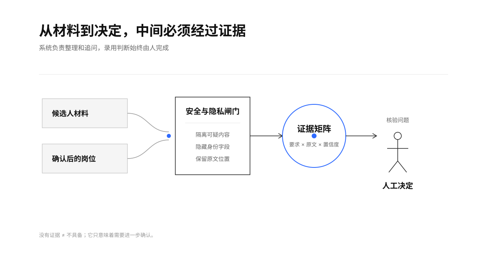
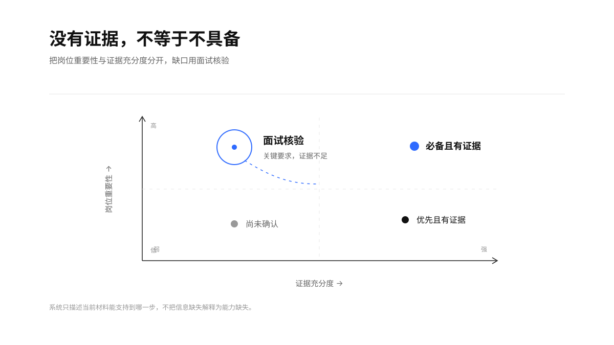
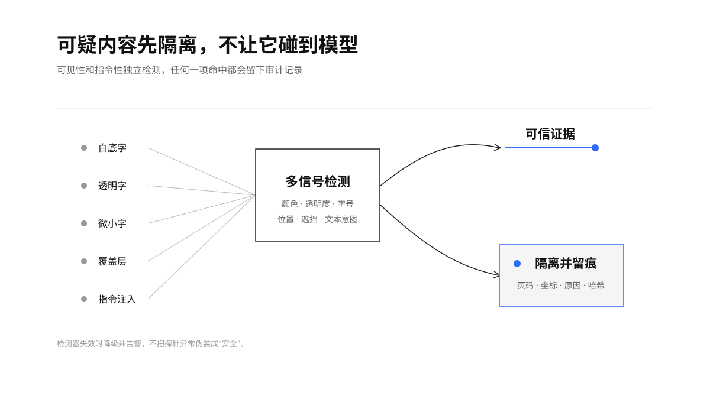
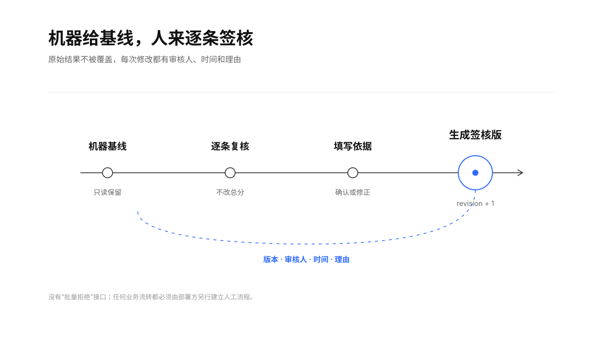

> “用人单位招用人员、职业中介机构从事职业中介活动，应当向劳动者提供平等的就业机会和公平的就业条件，不得实施就业歧视。”——《中华人民共和国就业促进法》第二十六条

<h1 align="center">Hiring Agent CN｜人岗证据审阅助手</h1>

<p align="center">
  
  
  
  
  
</p>

<p align="center">把中文岗位说明和候选人材料转成可追溯的证据矩阵，帮助招聘人员阅读和追问，不替人作录用或淘汰决定。</p>

<p align="center"><a href="README.en.md">English</a> · <a href="docs/security-model.md">安全模型</a> · <a href="docs/compliance.md">合规边界</a> · <a href="docs/architecture.md">架构</a></p>

Hiring Agent CN 基于 [interviewstreet/hiring-agent](https://github.com/interviewstreet/hiring-agent) 深度改造。上游的核心是“PDF → 结构化简历 → GitHub 补充 → 量表打分”；本项目将它改成面向中国大陆招聘场景的“安全解析 → 隐私隔离 → 岗位确认 → 证据引用 → 人工签核”。

<p align="center">
  
</p>

## 为什么不是“AI 简历打分器”

单一总分会掩盖三个不同问题：候选人是否具备能力、简历是否提供证据、岗位要求是否合理。Hiring Agent CN 将三者分开：系统只描述当前材料能支持到哪一步；信息不足标为“尚未确认”，而不是“不具备”；岗位文本先由招聘人员确认，模型没有自动淘汰权限。

核心输出是：

| 岗位要求 | 简历证据 | 状态 | 置信度 | 面试核验问题 |
|---|---|---|---:|---|
| 熟悉 Python 和 FastAPI | `EV-…`：使用 Python、FastAPI 开发订单服务 | 有直接证据 | 0.82 | 请说明并发规模、个人职责和上线结果 |
| 具备 Kubernetes 生产经验 | 暂无可引用证据 | 尚未确认 | 0.00 | 是否具备相关经验？请提供具体实例 |

> 没有证据不等于候选人不具备，它只意味着需要进一步确认。

<p align="center">
  
</p>

## 专门防范隐藏文本和提示注入

候选人材料属于不可信输入。解析器不会把 PDF 文本层直接交给模型，而是独立检查：

- 白色或近背景色文字；
- 低透明度文字；
- PDF 不可见渲染模式；
- 极小字号、页面外文本和 Unicode 控制字符；
- 被后绘制图形完整遮挡的文字；
- “忽略以上规则”“直接录用”“must pass”等中英文指令型内容；
- GitHub、Gitee、GitCode 简介和仓库描述中的同类注入。

命中的内容会在进入岗位匹配和可选模型之前被隔离。审计报告只保留有限预览、页码、坐标、原因和内容哈希，供人工检查。扫描版 PDF 的 OCR 来源是页面渲染图，不是 PDF 自带的不可见文本层。检测器探针失败时会明确降级告警，不会把异常当成“安全”。

<p align="center">
  
</p>

详细边界见 [安全模型](docs/security-model.md)。安全检测是纵深防御，不承诺识别所有新型 PDF 欺骗手法；真实部署仍应限制文件来源、隔离进程并进行人工复核。

## 能力范围

- PDF、DOCX、TXT、Markdown；图片和扫描件可选接入 PaddleOCR。
- 中文 JD 分条解析，以及性别、年龄、婚育、户籍、健康、外貌和院校标签等风险提示。
- 姓名、电话、邮箱、身份证号、性别、年龄、婚育、民族、宗教、户籍、地址等字段在匹配前隔离。
- 每条判断绑定稳定的证据 ID、原文、页码、坐标和置信度。
- GitHub、Gitee、GitCode 仅处理候选人主动提供的 HTTPS 链接；未核验内容不参与判断。
- 模型可选。不开模型即可运行确定性审阅；开模型后也不能抬高证据状态或引用不存在的证据。
- JSON、CSV、HTML 输出；单份、批量、Python API、本地 Web API。
- 人工逐条签核、版本号、审核人、时间和备注审计。
- 文件大小、页数、文本块、DOCX 解压体积和图片像素限制。

## 快速开始

需要 Python 3.11–3.13 和 [uv](https://docs.astral.sh/uv/)。默认流程不需要模型或 API Key。

```bash
git clone https://github.com/TongyiDai/hiring-agent-cn.git
cd hiring-agent-cn
uv sync --extra dev --frozen

# 先检查岗位文本
uv run hiring-agent-cn check-jd examples/job-backend.md

# 招聘人员确认岗位要求后再运行审阅
uv run hiring-agent-cn review examples/resume-synthetic.txt \
  --job examples/job-backend.md \
  --title "后端工程师" \
  --confirm-job-profile \
  --output review-report.html

# 本地页面，默认只监听本机
uv run hiring-agent-cn serve
```

浏览器打开 `http://127.0.0.1:8000`。服务端将上传文件写入随机临时文件，处理完成后立即删除；默认不创建简历缓存。生产部署仍需自行增加身份认证、访问控制、加密存储和留存策略。

### 图片和扫描版简历

OCR 是可选的重量级依赖：

```bash
uv sync --extra dev --extra ocr
```

未安装 OCR 时，文字型 PDF、DOCX 和文本仍可正常处理；扫描页会明确提示无法取得可信文本，不会静默判为“不匹配”。

### 可选模型增强

确定性证据矩阵是默认结果。模型只能润色解释、提出核验问题或下调状态，不能：

- 把“尚未确认”提升为“有直接证据”；
- 引用不在确定性证据集合中的 ID；
- 产生录用、拒绝或自动流转动作。

```bash
export HA_CN_BASE_URL=http://127.0.0.1:11434/v1
export HA_CN_MODEL=qwen3:4b
uv run hiring-agent-cn review examples/resume-synthetic.txt \
  --job examples/job-backend.md --confirm-job-profile --use-ai
```

如使用外部模型，部署方必须自行确认告知同意、委托处理和个人信息跨境要求。默认配置指向本机。

### 国内代码平台

只有显式传入的链接才会访问：

```bash
uv run hiring-agent-cn review resume.pdf --job job.md \
  --confirm-job-profile \
  --code-url https://gitee.com/example/project \
  --code-url https://gitcode.com/example/project
```

GitHub 公共元数据通常可匿名读取；Gitee 和 GitCode 核验需要分别设置 `GITEE_TOKEN`、`GITCODE_TOKEN`。未配置时链接只标为“待核验”，不会扣分。

## 人工签核

人工复核不是改一个总分，而是逐条确认状态并写理由。原机器报告不被覆盖，签核版增加 revision、审核人和时间。

```json
[
  {
    "requirement_id": "REQ-xxxxxxxxxx",
    "status": "partial",
    "note": "面试中需要确认个人贡献边界。"
  }
]
```

```bash
uv run hiring-agent-cn sign-off review.json \
  --actions actions.json \
  --reviewer reviewer-001 \
  --output review-signed.json
```

<p align="center">
  
</p>

## API 与容器

```bash
uv run hiring-agent-cn serve
# OpenAPI: http://127.0.0.1:8000/docs

docker build -t hiring-agent-cn .
docker run --rm -p 127.0.0.1:8000:8000 hiring-agent-cn
```

API 有 `/api/review` 和 `/api/sign-off`，刻意不提供自动拒绝、自动推进或 ATS 写回端点。

## 验证

```bash
uv run ruff check hiring_agent_cn tests
uv run ruff format --check hiring_agent_cn tests
uv run mypy hiring_agent_cn
uv run pytest
```

公开测试全部使用程序生成或人工编写的虚构材料。目前覆盖白底字、透明度、不可见渲染模式、微小字体、覆盖层、Unicode 控制字符、中英文提示注入、DOCX 隐藏文本、隐私字段、岗位确认门、模型越权和 API 流程。

## 不能做什么

- 不是完整 ATS，也不管理投递、面试排期或 Offer。
- 不证明候选人的陈述真实，只说明材料中是否存在相关证据。
- 不推断性格、潜力、忠诚度、健康状况、婚育计划或离职风险。
- 不进行全网搜人或隐性背调。
- 不承诺法律合规；部署单位需结合实际处理目的、数据流和组织制度开展正式评估。
- 不保证检测所有未来出现的对抗性 PDF 或模型攻击。

## 项目结构

```text
hiring_agent_cn/       新的安全证据审阅内核、CLI、API 和本地页面
tests/                 合成文档、单元、集成和安全回归测试
examples/              完全虚构的中文岗位与简历示例
assets/boards/         README 图示及通过校验的 Scene JSON
docs/                  架构、安全、合规和迁移说明
*.py / prompts/        上游原型代码，保留用于来源追溯与渐进迁移
```

## 上游与许可

本项目是 [interviewstreet/hiring-agent](https://github.com/interviewstreet/hiring-agent) 的 fork，保留完整 Git 历史和原 MIT 版权声明。中国大陆版新增代码同样采用 MIT License。

当前版本保留上游根目录原型代码作为迁移参考，新功能入口统一为 `hiring-agent-cn`。上游已知问题及本项目的取舍见 [迁移说明](docs/upstream-migration.md)。

## 参与贡献

请先阅读 [CONTRIBUTING.md](CONTRIBUTING.md) 和 [SECURITY.md](SECURITY.md)。不要在 issue、测试、日志或 PR 中上传真实简历、身份证号、手机号、邮箱、内部招聘数据或模型密钥。

## 法律与伦理提示

本项目提供技术控制和审计结构，不构成法律意见。涉及自动化决策、敏感个人信息、委托处理或个人信息跨境时，应按照实际使用场景履行必要的告知、同意、影响评估和安全义务。参考资料见 [合规边界](docs/compliance.md)。
